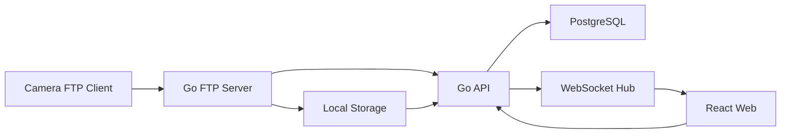

# Go + React Web 重写架构建议

## 目标边界

用户已确认只做 Web，且以 `12-confirmed-web-scope.md` 为最终范围来源。Web 版不追求复刻原项目的本地跨平台 companion 形态，而是保留相机 FTP 上传、照片入库、照片浏览和系统信息展示。

明确不做：

- Android、Windows 桌面端、Tauri IPC、系统托盘、前台服务、MediaStore 和原生图片查看器。
- RBAC、多用户、用户管理、审计日志。
- AI 修图、AI 队列、AI provider 配置。
- FTPS、证书管理。
- NAS/S3/MinIO/对象存储抽象。
- 多页面后台管理台和复杂配置中心。

## Web 版产品形态

Web 版定义为“相机 FTP 图传 Web 服务”：

- Docker Compose 是正式部署方式。
- Go 后端同时提供 Web API、WebSocket 和 FTP 服务。
- React 前端只提供两个主页面：照片、系统信息。
- 相机通过 FTP 上传到 Go 服务管理的本地存储。
- PostgreSQL 保存账号、配置、媒体资产和传输事件。
- 文件允许所有格式上传，但照片页面只展示可识别为照片的资产。

## 架构选型

### 后端框架

推荐使用 `Gin` 或 `Echo`。本项目 API 面较小，优先考虑团队熟悉度和中间件生态。后端需要同时管理：

- Web 登录和默认系统账号。
- FTP 账号和匿名策略。
- FTP server lifecycle。
- 本地文件存储和 hash 去重。
- PostgreSQL 持久化。
- WebSocket 事件推送。

### 数据库

使用 PostgreSQL，作为配置、账号、媒体资产和事件的唯一持久化来源。不要继续沿用本地 JSON 配置作为 Web 版真源。

### 实时通信

使用 WebSocket。页面加载时先通过 REST 拉取快照，之后通过 WebSocket 接收上传、删除、覆盖、系统状态变化等增量事件。

### FTP 服务

候选库：

- `github.com/fclairamb/ftpserverlib`
- 其他支持自定义认证、被动模式、本地存储后端和上传完成 hook 的 Go FTP server 库

必须验证：

- 支持 PASV/被动模式端口范围配置。
- 支持单个默认 FTP 账号。
- 支持匿名访问，且不做 IP 限制。
- 能拦截上传完成事件。
- 能限制用户根目录并防止路径穿越。
- 能对上传结果计算 hash 并写入 PostgreSQL。

FTPS 不在目标范围内。

### 文件存储

只做服务器本地存储。Docker Compose 需要挂载数据卷，例如：

```txt
/data/falcondrop/uploads
/data/falcondrop/tmp
```

存储规则：

- 保留原文件名用于展示。
- 用文件内容 hash 去重。
- 同名且 hash 一致时允许覆盖。
- 同名但 hash 不一致时不覆盖，内部存储路径必须生成冲突后缀或 hash 子路径。
- 删除时直接删除本地文件和数据库记录。

### 前端

推荐：

- React + TypeScript + Vite
- TanStack Query 或轻量 fetch client
- Zustand 仅保存局部 UI 状态
- TailwindCSS 或现有设计系统

前端视图保持克制：

- 照片页：时间分类、照片网格/列表、预览、删除。
- 系统信息页：系统版本、系统 hash、系统时间、系统账号、FTP 账号、FTP 连接信息、运行状态。
- 页面展示文案除专业术语外一律使用中文；专业术语如 `Docker Compose`、`PostgreSQL`、`WebSocket`、`FTP`、`EXIF`、`hash`、`API` 可保留英文。

## 推荐系统架构



## 后端目录结构建议

```txt
backend/
├── cmd/
│   └── api/
│       └── main.go
├── internal/
│   ├── api/
│   │   ├── router.go
│   │   ├── middleware/
│   │   └── handlers/
│   ├── auth/
│   │   ├── service.go
│   │   ├── password.go
│   │   └── session.go
│   ├── config/
│   │   ├── model.go
│   │   └── service.go
│   ├── ftpserver/
│   │   ├── manager.go
│   │   ├── auth.go
│   │   ├── storage.go
│   │   └── events.go
│   ├── media/
│   │   ├── model.go
│   │   ├── service.go
│   │   ├── exif.go
│   │   └── hashing.go
│   ├── storage/
│   │   └── local.go
│   ├── system/
│   │   └── service.go
│   ├── realtime/
│   │   ├── hub.go
│   │   └── events.go
│   └── db/
│       ├── migrations/
│       └── queries/
├── api/
│   └── openapi.yaml
├── deployments/
│   ├── Dockerfile
│   └── docker-compose.yml
└── go.mod
```

## 前端目录结构建议

```txt
frontend/
├── src/
│   ├── app/
│   │   └── providers.tsx
│   ├── api/
│   │   └── client.ts
│   ├── features/
│   │   ├── auth/
│   │   ├── photos/
│   │   └── system-info/
│   ├── components/
│   │   └── ui/
│   ├── stores/
│   ├── types/
│   └── utils/
├── package.json
└── vite.config.ts
```

## 数据库设计建议

| 表 | 用途 | 关键字段 |
|---|---|---|
| `system_accounts` | 唯一 Web 默认账号 | id, username, password_hash, updated_at |
| `ftp_account` | 唯一 FTP 默认账号 | id, username, password_hash, anonymous_enabled, updated_at |
| `app_settings` | 系统配置 | key, value_json, updated_at |
| `ftp_server_state` | FTP 服务状态快照 | id, status, host, port, passive_ports, updated_at |
| `media_assets` | 上传文件资产 | id, original_filename, storage_path, content_hash, size, mime_type, is_photo, exif_taken_at, uploaded_at |
| `transfer_events` | 上传/覆盖/删除事件 | id, asset_id, event_type, original_filename, content_hash, remote_addr, created_at |

## API 设计规范

### 认证

| 方法 | 路径 | 功能 |
|---|---|---|
| `POST` | `/api/auth/login` | 默认系统账号登录 |
| `POST` | `/api/auth/logout` | 退出 |
| `GET` | `/api/auth/me` | 当前账号 |

### 照片

| 方法 | 路径 | 功能 |
|---|---|---|
| `GET` | `/api/photos` | 按 EXIF 时间分页/分组查询照片 |
| `GET` | `/api/photos/{id}` | 照片详情 |
| `GET` | `/api/photos/{id}/content` | 原图访问 |
| `DELETE` | `/api/photos/{id}` | 直接删除照片文件和记录 |

### 上传资产

| 方法 | 路径 | 功能 |
|---|---|---|
| `GET` | `/api/assets` | 查询全部上传资产，可包含非照片文件 |
| `GET` | `/api/assets/{id}` | 资产详情 |

### 系统信息

| 方法 | 路径 | 功能 |
|---|---|---|
| `GET` | `/api/system/info` | 系统版本、hash、时间、账号、FTP 账号和运行状态 |
| `GET` | `/api/ftp/status` | FTP 连接信息和运行状态 |
| `PUT` | `/api/ftp/account` | 更新唯一 FTP 账号和匿名策略 |
| `PUT` | `/api/system/account` | 更新唯一 Web 默认账号 |

### 实时事件

| 方法 | 路径 | 功能 |
|---|---|---|
| `GET` | `/api/ws` | WebSocket 事件通道 |

事件类型建议：

- `system-status`
- `ftp-started`
- `ftp-stopped`
- `asset-uploaded`
- `asset-overwritten`
- `photo-added`
- `photo-deleted`

## 权限设计方案

Web 版只需要一个默认系统账号，不做 RBAC。登录后拥有全部系统操作权限。

FTP 侧只需要一个默认 FTP 账号，并支持匿名访问。匿名访问不限制 IP。匿名开放存在安全风险，UI 和系统信息页需要清晰展示当前状态。

## 状态管理方案

### 后端

- FTP 运行态由 `ftpserver.Manager` 管理。
- 上传事件写入 `transfer_events` 和 `media_assets`。
- 照片识别和 EXIF 时间解析在上传完成后执行。
- WebSocket 推送照片新增、覆盖、删除和系统状态变化。

### 前端

- TanStack Query 或轻量请求封装管理 REST 快照。
- WebSocket 更新照片列表和系统信息。
- Zustand 仅保存当前视图、筛选时间和预览状态。

## 错误处理方案

统一错误响应：

```json
{
  "code": "FTP_PORT_UNAVAILABLE",
  "message": "端口不可用",
  "requestId": "req_..."
}
```

核心错误码：

- `AUTH_REQUIRED`
- `FTP_ALREADY_RUNNING`
- `FTP_NOT_RUNNING`
- `FTP_PORT_UNAVAILABLE`
- `FTP_PASSIVE_PORT_NOT_CONFIGURED`
- `STORAGE_NOT_WRITABLE`
- `MEDIA_NOT_FOUND`
- `SYSTEM_ACCOUNT_INVALID`
- `FTP_ACCOUNT_INVALID`

## 日志方案

- 使用 `zap` 或 `slog`。
- 日志输出到 stdout，由 Docker 收集。
- 上传、覆盖、删除写 `transfer_events`。
- 不做审计日志系统。

## 部署方案

Docker Compose 是正式部署方式。

```txt
deployments/
├── docker-compose.yml
├── Dockerfile
└── nginx.conf
```

服务：

- `app`: Go API + FTP server + React 静态资源。
- `postgres`: PostgreSQL。

部署注意：

- FTP 控制端口和 PASV 端口范围必须在 Docker 端口映射、防火墙和运行环境中开放。
- Web HTTPS 可由 Nginx/Caddy/外部网关处理。
- 本地上传目录必须挂载持久化数据卷。
- 不部署 Redis、MinIO、AI worker 或独立对象存储。

## 明确不复刻的原生功能

| 原项目能力 | Web 版处理 |
|---|---|
| Android MediaStore | 不复刻 |
| Android 前台服务/WakeLock/WiFiLock | 不复刻 |
| Android WebView JS Bridge | 不复刻 |
| Android 内置图片查看 Activity | 不复刻 |
| Windows 托盘/自启动 | 不复刻 |
| Windows 打开文件夹并选中文件 | 不复刻 |
| Tauri 二级预览窗口 | 不复刻 |
| AI 修图 | 不复刻 |
| FTPS | 不复刻 |
| 对象存储 | 不复刻 |

## 测试建议

| 层级 | 测试 |
|---|---|
| Go 单元 | 登录、默认账号、FTP 账号、hash 去重、存储路径、EXIF 时间解析 |
| Go 集成 | FTP 匿名上传、FTP 账号上传、PASV、媒体入库、WebSocket 推送 |
| 前端单测 | 登录、照片按时间分组、系统信息展示、删除确认 |
| E2E | 登录 -> FTP 上传照片 -> WebSocket 刷新 -> 按 EXIF 时间展示 -> 删除 |
| 部署测试 | Docker Compose、端口映射、数据卷权限、PostgreSQL 持久化 |
